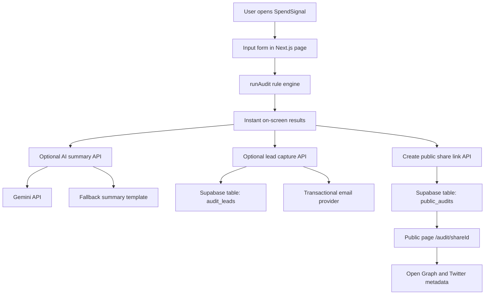

# Architecture

## System diagram (Mermaid)

## Data flow: input to audit result

1. User enters plan, spend, seats, team size, and use case.
2. Form state is saved in local storage, so refresh does not lose progress.
3. `runAudit` checks each tool with fixed rules:
   - keep current setup baseline
   - right-size plan for small seat teams
   - compare with lower-cost alternatives for same use case
   - apply credit discount scenario
4. Engine picks the cheapest valid scenario per tool.
5. App shows:
   - tool-level recommendation
   - monthly and annual total savings
   - lead tier (`low`, `medium`, `high`)

## Why this stack

- **Next.js + TypeScript**: fast to build, good routing, strong typing.
- **Tailwind**: quick UI polish for a clear report page.
- **Supabase**: simple hosted Postgres with fast API integration.
- **Zod**: request validation on API routes.
- **Vitest**: quick tests for rule engine logic.

This stack helps ship MVP fast while keeping code readable and testable.

## Lead capture abuse protection

`POST /api/leads` (`web/src/app/api/leads/route.ts`):

- **Honeypot:** optional `website` field — humans never see it; if it is filled, the handler returns success text and skips DB insert (stops dumb bots).
- **Rate limit:** in-memory map keyed by first IP in `x-forwarded-for`, max **8** requests per **10** minutes; returns **429** when exceeded.

Why not hCaptcha yet: faster MVP, fewer steps for a real founder filling out one form. Trade-off: in-memory limit resets on cold start and is not shared across server instances — fine for low traffic; at scale use Redis or edge rate limiting.

## If this needs to handle 10k audits/day

I would make these upgrades:

1. Move rate limiting to Redis (shared store) instead of in-memory map.
2. Cache repeated audit calculations by normalized input hash.
3. Split heavy API work (emails, summaries) into background jobs.
4. Add DB indexes and retention policy for old payloads.
5. Add queue + retries for email and LLM calls.
6. Add monitoring (latency, API errors, DB load, drop-off funnel).
7. Add multi-region deployment or edge caching for public share pages.
