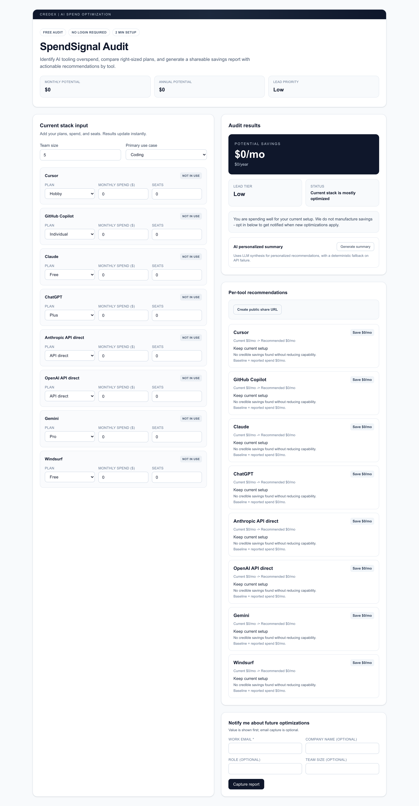
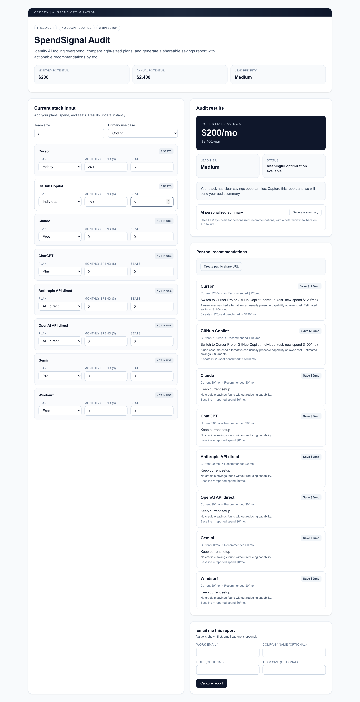
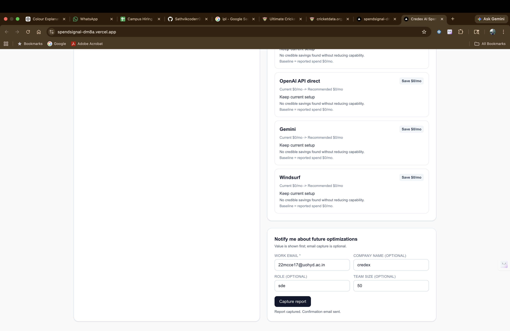

# SpendSignal (Credex AI Spend Audit)

SpendSignal is a free tool for startup founders and engineering managers who want to reduce AI tool costs. Users enter their current tools, plans, spend, seats, team size, and use case, then instantly get a clear savings report with action steps.

It is built as a Next.js app in `web/` and includes an audit engine, AI summary generation, lead capture, and public share links.

## Screenshots

Home + input form:



Audit results + per-tool actions:



Public share page:



**Demo (screen recording):** [YouTube — SpendSignal walkthrough](https://youtu.be/Lox-3u4IIjM)

## Quick start

```bash
cd web
npm install
npm run dev
```

Open `http://localhost:3000`.

## Deploy

Deploy the `web/` folder to Vercel, Netlify, or Render.

Set these environment variables in your host dashboard:

- `SUPABASE_URL`
- `SUPABASE_SERVICE_ROLE_KEY`
- `APP_URL`
- `GEMINI_API_KEY` (optional, summary fallback works without it)
- `NEXT_PUBLIC_CREDEX_CONSULT_URL` (optional; high-savings “Book consultation” link — defaults to `https://credex.rocks`)
- `NEXT_PUBLIC_APP_URL` / `APP_URL` (canonical URL for share links; see `web/src/lib/server/publicAppUrl.ts`)
- Email provider vars (`POSTMARK_*` or `SENDGRID_*` or `TWILIO_*`)

Copy `web/.env.example` to `web/.env.local` and fill values. Never commit `.env.local` or secret files.

### Lead API abuse protection

`/api/leads` uses two light controls (no CAPTCHA, less friction for real users):

1. **Honeypot** — hidden `website` field in the form. Bots often fill every field; if it is non-empty, the API returns 200 with a generic “accepted” message and **does not** insert a row.
2. **Rate limit** — by client IP from `x-forwarded-for`, max **8** POSTs per **10 minutes** per IP; over limit returns **429**.

Why this choice: fast to ship, no third-party keys, blocks naive spam scripts. Trade-off: shared IPs (offices) can hit the cap; in production I would move limits to Redis or a gateway rule.

## Live URL

[https://spendsignal-dm8a.vercel.app](https://spendsignal-dm8a.vercel.app/)

## Lighthouse (mobile, for the brief)

Credex asks for **mobile** scores on the **deployed** URL: Performance ≥ 85, Accessibility ≥ 90, Best Practices ≥ 90.

**Chrome extensions often lower Performance.** Lighthouse even warns about this. For a fair number:

1. Use **Incognito** (or a Chrome profile with **no extensions**), **mobile** device preset, then run Lighthouse again.
2. Or use the CLI so extensions are not in the way:

```bash
cd web
npx lighthouse https://spendsignal-dm8a.vercel.app \
  --only-categories=performance,accessibility,best-practices \
  --form-factor=mobile \
  --chrome-flags="--headless --disable-extensions --no-sandbox" \
  --view
```

3. Test the **production** build when possible (`npm run build` then `npm run start` locally, or the live Vercel URL after deploy).

Your latest run (**76 / 91 / 100 / 100**) already passes Accessibility, Best Practices, and SEO. Performance is **9 points** below 85; a clean run without extensions often bumps that up. If it stays under 85 after that, say so and we can dig into LCP/TBT next.

## Repo layout

- `web/` — Next.js app (UI, engine, API, share pages)
- `web/supabase/schema.sql` — required DB tables
- `.github/workflows/ci.yml` — lint + test on push to `main`
- Root docs (`ARCHITECTURE.md`, `DEVLOG.md`, `REFLECTION.md`, etc.) — assignment deliverables

## Decisions (5 trade-offs)

1. **Deterministic rules for audit math, not AI**
   - Why: savings logic must be finance-defensible and repeatable.
   - Trade-off: less flexible than an AI-only engine, but much safer.

2. **AI only for personalized summary**
   - Why: summary tone can benefit from LLM writing, but numbers must stay rule-based.
   - Trade-off: added API dependency, handled with strong fallback.

3. **Supabase for both leads and shared audits**
   - Why: one backend for two data paths keeps setup simple.
   - Trade-off: tighter coupling to Supabase in MVP stage.

4. **Local storage for form persistence**
   - Why: best UX for no-login flow; users can refresh and keep work.
   - Trade-off: stored state is per browser/device, not cross-device.

5. **Simple anti-abuse (rate limit + honeypot)**
   - Why: enough for MVP and fast to ship.
   - Trade-off: not as strong as CAPTCHA, but less friction for real users.
